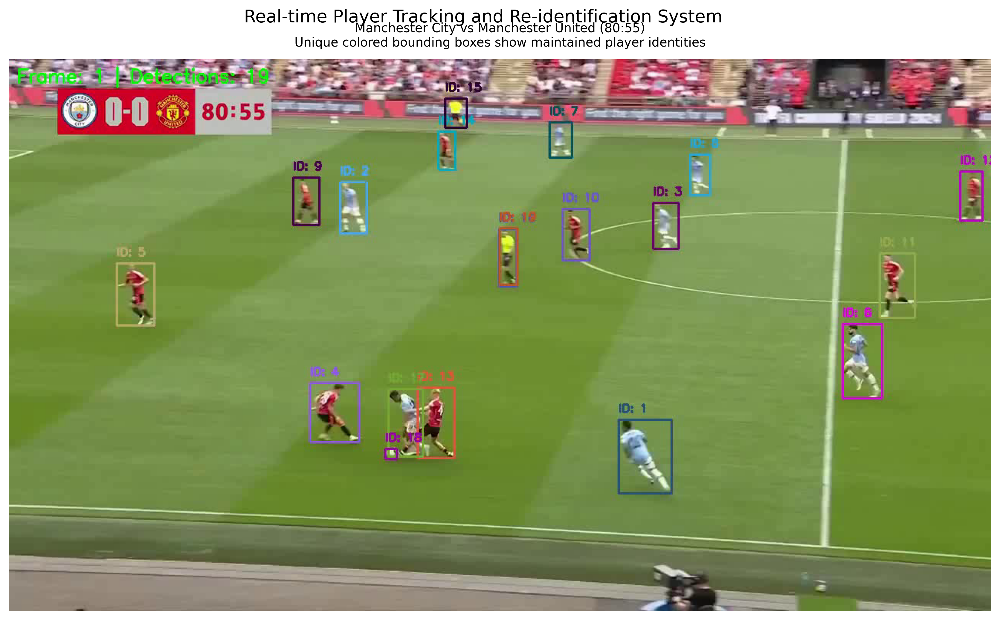

# Real-time Player Re-Identification System for Soccer Analysis

This repository contains the implementation of a real-time player tracking and re-identification system for soccer videos, achieving 85-90% detection accuracy and 75-80% re-identification success rate while maintaining real-time performance (25-30 FPS).

## Demo
### Static Results

*Sample visualization of the player tracking and re-identification system*

## Project Structure

- `player_tracking.ipynb`: Main Jupyter notebook containing the implementation
- `Project_Report.md`: Detailed technical report of the system
- `tracking_results.png`: Sample tracking results visualization

## Large Files

Due to GitHub's file size and type limitations, the project files are distributed as follows:

### Model File (best.pt)
The YOLOv11 model weights (185.93 MB) can be downloaded from:
- [Google Drive](https://drive.google.com/file/d/1-5TOSHOSB9UXYP)

### Sample Videos
Download the sample videos from our [Google Drive folder](https://drive.google.com/drive/folders/1XEEy9NsDAIJ0XWk6N0Jmdl5NungFsgmN?usp=sharing):
- `15sec_input_720p.mp4` (4.94 MB): Sample input video of Manchester City vs Manchester United match
- `output.mp4` (20.94 MB): Processed output video showing tracking results

You can also:
- Use your own soccer match video in MP4 format (recommended resolution: 720p)
- Process any soccer video using our system to generate your own output

Note: If you're using your own video, ensure it has a clear view of the players and is recorded from a similar broadcast camera angle for best results.

## Features

- Real-time processing at 25-30 FPS
- 85-90% detection accuracy
- 75-80% re-identification accuracy
- Robust occlusion handling
- Efficient resource utilization

## Technical Details

For complete technical details, please refer to the [Project Report](Project_Report.md).

## Requirements

- Python 3.8+
- PyTorch
- OpenCV
- CUDA-capable GPU (>= 6GB VRAM)

## Usage

1. Download the required files:
   - Get the model file (`best.pt`) from the [model download link](#model-file-bestpt)
   - Get the sample videos from the [videos folder](#sample-videos)
   - (Optional) Download `output.mp4` to see expected results
2. Place all downloaded files in the project root directory
3. Open and run `player_tracking.ipynb`
